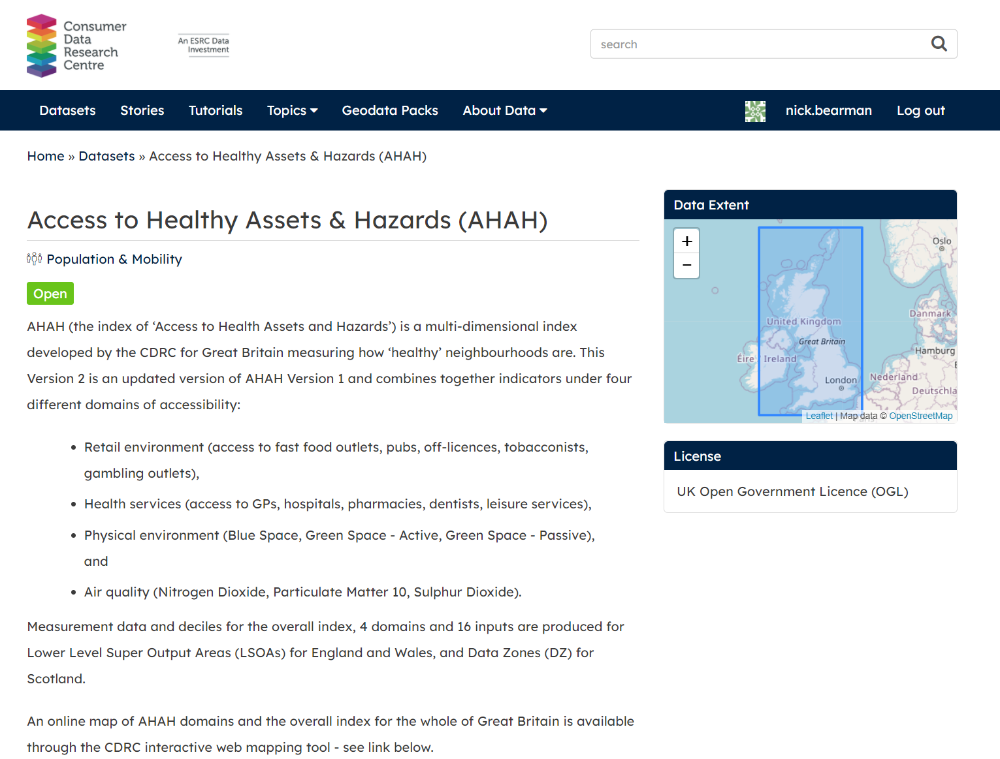

```{r setup, include=FALSE}
knitr::opts_chunk$set(echo = TRUE)
#set working directory to /data-user
knitr::opts_knit$set(root.dir = 'C:/Users/nick/Dropbox/Work/2020-010-CDRC-training/ahah-multi-dimensional-indices/cdrc-ahah-mdi-course-material-repo/data-user')
```

# Welcome

This is part 1 of the 2 part course from CDRC on the Access to Healthy Assets & Hazards (AHAH) dataset and creating Multi Dimensional Indices. The video in this part introduces the AHAH data set, and the practical session shows you how to work with the AHAH dataset in R. *If you are completely new to RStudio, please check out our [Short Course on Using R as a GIS](https://data.cdrc.ac.uk/dataset/short-course-using-r-gis)*. 

After completing this material, you will:  

- Know what AHAH is and what it can be used for  
- Be aware of how AHAH was created  
- Understand some of its key strengths and weaknesses  
- Know how to use Access to Healthy Assets & Hazards (AHAH) in RStudio  

----

<iframe width="560" height="315" src="https://www.youtube.com/embed/N5jMOs9dZaY" frameborder="0" allow="accelerometer; autoplay; clipboard-write; encrypted-media; gyroscope; picture-in-picture" allowfullscreen></iframe>

----

# Part 1: Access to Healthy Assets & Hazards (AHAH)

### Downloading AHAH Data

Our first step is to download the AHAH dataset:

- Open a web browser and go to https://data.cdrc.ac.uk  

- Register if you need to, or if you are already registered, make sure you are logged in.  

- Search for AHAH.  

- Open the Access to Healthy Assets & Hazards (AHAH) page.  

{ width=80% }

- Scroll down and choose the download option for the AHAH Overall Index and Domains  

{ width=80% }

- Save the `ahahv2domainsindex.csv` file to your working directory.  

- Open the file in Excel - what data do we have?  

- *Check out the Metadata download if you need to.*  

### Loading AHAH data in R

- Start a new Script in RStudio.  

- Set your working directory.  

- Use this code to read in the file:

```{r, comment=NA}
ahah <- read.csv("ahahv2domainsindex.csv")
```

- Use `head()` to check what the data are:

```{r, comment=NA}
head(ahah)
```

- Is this the data we expect to see?  

- Use `View()` to look at the data.  

- Use `str()` to see whether they are character or numeric variables.  

```{r, comment=NA}
str(ahah)
```

- Is this what you expect?  

*There will be character `chr`, integer `int` and numeric `num` values in this data frame. Make sure you can identify which is which, and that you know what the differences are.*

- How are the data distributed? (try `hist()`).  

### Loading Spatial Data

To create any maps, we need some spatial data. 

- Go to http://census.edina.ac.uk/ and select **Boundary Data Selector**. 
- Then set **Country** to **England**, **Geography** to **Statistical Building Block**, **dates** to **2011 and later**, and click **Find**.
- Select **English Lower Layer Super Output Areas, 2011** and click **List Areas**. 
- Select **Liverpool** from the list and click **Extract Boundary Data**. 
- After a 5 to 20 second wait, click `BoundaryData.zip` to download the files. 

Extract the files, and move all the files starting with the name `england_lsoa_2011` to your working folder. 
  
```{r, echo=FALSE, comment=NA}
unzip("england_lsoa_2011.zip")
```

We will also need some spatial libraries:

```{r,message=FALSE,display=FALSE, warning = FALSE}
#load libraries
library(sf)
library(tmap)
```

Read in the spatial data we downloaded from Edina:

```{r, comment=NA, results='hide'}
#read in shapefile
LSOA <- st_read("england_lsoa_2011.shp")
```

- Has the data been read in correctly? Try `head()`, `class()` and `str()`. 
 
Let's do a quick map:

```{r, comment=NA}
qtm(LSOA)
```

- Is the data correct? *Does it look the data we were expecting to see?*  

### Joining Attribute and Spatial Data

Next step is to join the attribute data (`ahah`) to the spatial data (`LSOA`). 

Use `head()` to check which columns we are using for the join:

```{r, comment=NA, eval=FALSE}
#check which columns we are joining
head(ahah)
head(LSOA)
```

```{r, comment=NA}
#join attribute data to LSOA
LSOA <- merge(LSOA, ahah, by.x="code", by.y="lsoa11")

#check output
head(LSOA)
```

Finally, we can plot the maps quickly using `qtm()` from the `tmap` library:

```{r, comment=NA}
#ahah index
qtm(LSOA, "ahah")
#ahah deciles
qtm(LSOA, "d_ahah")
```

This works well, and we can choose which variable to show. However we don't get many options with this. We can use a different function `tm_shape()`, which will give us more options. 

```{r echo=TRUE, eval=FALSE}
tm_shape(LSOA) +
tm_polygons("ahah")
```

```{r echo=TRUE, eval=FALSE}
tm_shape(LSOA) +
tm_polygons("ahah", title = "AHAH Index", palette = "Greens", style = "jenks") +
tm_layout(legend.title.size = 0.8)
```

This allows us to change the title, colours and legend title size. Try substituting in `Blues` and adjusting the title. 

- Why are the different colours important?  
- Which classification method should we use?  

*If you are not sure about classification, look at [Part 2: Mapping Spatial Data](https://data.cdrc.ac.uk/system/files/short-course-r-gis_0.html#part2) of the [Short Course on Using R as a GIS](https://data.cdrc.ac.uk/dataset/short-course-using-r-gis).  

We have the data for AHAH, but we also have the domain data as well. Can you plot a map for one of the domains? 

### Exercise

By now you should have a R script with all the steps to:

- read in the AHAH data  
- read in the spatial data (for whatever area you want to show)  
- join the two data sets  
- plot a map  

Try creating a map for a different area of the UK, using the script you have. 

<!-- What problems do you come across? -->
  
<!-- limitations of AHAH -->
<!-- limitations of R -->

# Additonal Exercises

### Routing in Routino

Routino is one of the key pieces of software used to create the data used in the AHAH index. You can see how the routing is done using the example tool on the website. 

- Go to http://www.routino.org/  
- Click **Calculate Route (UK)** on the top left   
- Click on the **Leaflet Version** map  
- Under **1** under **Waypoints**, type in a location or postcode and press enter  
- A list may appear beneath - select the location from the list  
- Repeat the process for **2** (destination)  
- Choose an appropriate transport type (*Motorcar* is default)  
- Click on **Shortest Route** 
- It will show *Router Running*. It may take 10 seconds or so. 
- It will then show the route (you may need to adjust the map). 
<!-- last updated 2020-09-23 -->

{ width=80% }

Working with loops is key for the creation of this dataset. 

### Loops

Loops are a great computer programming concept we can use. Working from the example above, and the loop code from the [Short Course on Using R as a GIS](https://data.cdrc.ac.uk/dataset/short-course-using-r-gis), can you write a loop to create a map for each domain of the AHAH index?

**Mini R Course loop code:**

```{r message=FALSE, warning=FALSE, comment=NA, eval=FALSE}
#set which variables will be mapped
  mapvariables <- c("AllUsualResidents", "Age00to04", "Age05to07")

#loop through for each map
  for (i in 1:length(mapvariables)) {
  #setup map
    m <- tm_shape(LSOA) +
      #set variable, colours and classes
      tm_polygons(mapvariables[i], palette = "Greens", style = "equal") +
      #set scale bar
      tm_scale_bar(width = 0.22, position = c(0.05, 0.18)) +
      #set compass
      tm_compass(position = c(0.3, 0.07)) + 
      #set layout
      tm_layout(frame = F, title = "Liverpool", title.size = 2, 
                title.position = c(0.7, "top"))
    #save map
    tmap_save(m, filename = paste0("map-",mapvariables[i],".png"))
  #end loop
  }
```

----

This practical was written using R 3.5.1 (2018-07-02) and RStudio 1.1.463, and tested on R 4.0.2 (2020-06-22) and RStudio Cloud (RStudio Server Pro Version 1.3.1056-1) by Dr. Nick Bearman (nick@geospatialtrainingsolutions.co.uk). 

This work is licensed under the Attribution-NonCommercial-ShareAlike 4.0 International License. To view a copy of this license, visit http://creativecommons.org/licenses/by-nc-sa/4.0/. The latest version of the workbook is available from https://data.cdrc.ac.uk/dataset/advanced-gis-methods-training-ahah-and-multi-dimensional-indices and https://github.com/nickbearman/cdrc-ahah-mdi-course. This version was created on `r format(Sys.time(), '%d %B %Y')`. 

