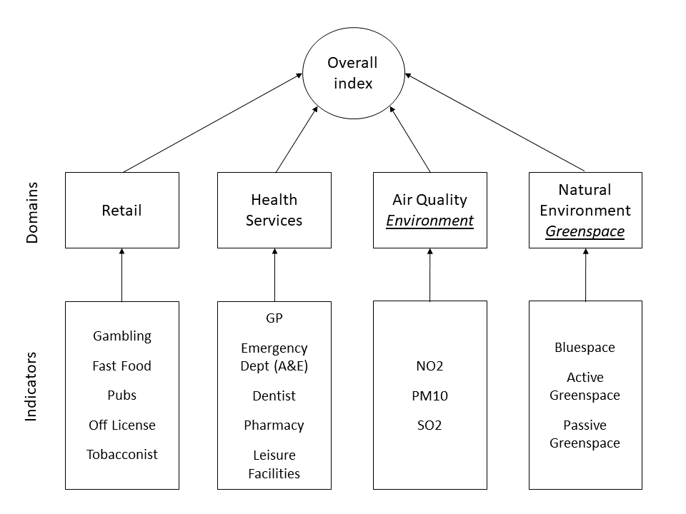

  
```{r setup, include=FALSE}
knitr::opts_chunk$set(echo = TRUE)
#set working directory to /data-user
knitr::opts_knit$set(root.dir = 'C:/Users/nick/Dropbox/Work/2020-010-CDRC-training/ahah-multi-dimensional-indices/cdrc-ahah-mdi-course-material-repo/data-user')
```

# Welcome

This is part 2 of the 2 part course from CDRC on the Access to Healthy Assets & Hazards (AHAH) dataset and creating Multi Dimensional Indices. The video in this part introduces the concept of Multi Dimensional Indices data set, and the practical session shows you how to create your own MDI. 

After completing this material, you will:  

- Be able to recreate the AHAH MDI 
- Understand why we need to transform some of the data  
- Feel confident to add/remove domains from this index and understand the results  
- Be able to create your own multi dimensional index  

----

<iframe width="560" height="315" src="https://www.youtube.com/embed/VpWUT9ghVtc" frameborder="0" allow="accelerometer; autoplay; clipboard-write; encrypted-media; gyroscope; picture-in-picture" allowfullscreen></iframe>

----


# Part 2: Multi Dimensional Indices

We are going to replicate the AHAH index for two domains (Retail and Health). 

Just a quick reminder, the overall AHAH index is made up of four different domains:
1. Retail  
2. Health Services  
3. Air Quality *is called Environment in the code below*  
4. Natural Environment *is called Greenspace in the code below*  

Each domain is made up of a number of different indicators:  
  
  { width=80% }
  

  
### Downloading AHAH Source Data
  
To create an index, we are going to use the source files for AHAH. These are the distances to nearest for each LSOA. 

- Go to https://data.cdrc.ac.uk/dataset/access-healthy-assets-hazards-ahah  

- Download the AHAH Inputs/Components file: `allvariableslsoawdeciles.csv`  

- Also have a look at the metadata file if you wish.  

### Loading Source data in R

- Start a new Script in RStudio.  

- Set your working directory.  

- Use this code to read in the file:
  
```{r, comment=NA}
data <- read.csv("allvariableslsoawdeciles.csv")
```

- Use `head()` to check what the data are:
  
```{r, comment=NA}
head(data)
```

- Is this the data we expect to see?  
  
- Use `View()` to look at the data.  

- Is this what you expect?  
  
*There will be character `chr`, integer `int` and numeric `num` values in this data frame. Make sure you can identify which is which, and that you know what the differences are.*
  
- How are the data distributed? (try `hist()`).  
  
### Setup

We need some libraries for this work. Remember to install them if you haven't got them installed already. 

```{r message=FALSE, comment=NA}
#load libraries (and install if needed)
  library(nFactors)
  library(data.table)
  library(dplyr)
```

### Ranking the Data

When creating an index, we need to rank the data, rather than using the source distances. Additionally, all the data need to be in the same order (so, for example, low values are 'good' and high values are 'bad'). Use this code to rank the data, and then re-order it where needed.

```{r, comment=NA}
#the rank code reorders the data. for example:
#have a look at the gamb_dist data
head(data$gamb_dist)
#rank the data
data$gamb_dist_rank <- rank(data$gamb_dist,ties.method= "min")
#look at the data
head(data$gamb_dist_rank)
```
In this code we use a shortened version (where we overwrite the data rather than creating a new column each time). This saves us ending up with many many columns. 

Sometimes you might see a 0.5 value. This is when two values are the same, and so would usually have the same rank. The 0.5 R applies so these values can be put in order. 

```{r, comment=NA}
#retail
data$gamb_dist <- rank(data$gamb_dist,ties.method= "min")
data$gamb_dist <- rank(-data$gamb_dist) # Invert ranking
data$ffood_dist <- rank(data$ffood_dist,ties.method= "min")
data$ffood_dist <- rank(-data$ffood_dist) # Invert ranking
data$pubs_dist <- rank(data$pubs_dist,ties.method= "min")
data$pubs_dist <- rank(-data$pubs_dist) # Invert ranking
data$off_dist <- rank(data$off_dist,ties.method= "min")
data$off_dist <- rank(-data$off_dist) # Invert ranking
data$tobac_dist<- rank(data$tobac_dist,ties.method= "min")
data$tobac_dist <- rank(-data$tobac_dist) # Invert ranking

#health
data$gpp_dist <- rank(data$gpp_dist,ties.method= "min")
data$ed_dist <- rank(data$ed_dist,ties.method= "min")
data$dent_dist <- rank(data$dent_dist,ties.method= "min")
data$pharm_dist <- rank(data$pharm_dist,ties.method= "min")
data$leis_dist <- rank(data$leis_dist,ties.method= "min")
```

<!-- - Which ones have been re-ordered, and which ones have not? Why? -->
  
### Transformations
  
We also need to transform the data. We apply a Rankit rank-based normalisation to allow us to merge the rank based indicators. 

To apply this transformation we need to setup a custom function:

```{r, comment=NA}
#Rankit rank-based normalisation
  exp_default <- function(x,y){(x-0.5)/nrow(y)} 
```

We apply this `exp_default` function to the data, and then use the `qnorm` function to convert the ratios to measures (so we can combine them later on). 

```{r, comment=NA}
#retail
data$gamb_dist <- exp_default(data$gamb_dist, data)
data$gamb_dist <- qnorm(data$gamb_dist, mean = 0, sd = 1)
data$ffood_dist <- exp_default(data$ffood_dist, data)
data$ffood_dist <- qnorm(data$ffood_dist, mean = 0, sd = 1)
data$pubs_dist <- exp_default(data$pubs_dist, data)
data$pubs_dist <- qnorm(data$pubs_dist, mean = 0, sd = 1)
data$leis_dist <- exp_default(data$leis_dist, data)
data$leis_dist <- qnorm(data$leis_dist, mean = 0, sd = 1)
data$off_dist <- exp_default(data$off_dist, data)
data$off_dist <- qnorm(data$off_dist, mean = 0, sd = 1)
data$tobac_dist <- exp_default(data$tobac_dist, data)
data$tobac_dist <- qnorm(data$tobac_dist, mean = 0, sd = 1)

#health
data$gpp_dist <- exp_default(data$gpp_dist, data)
data$gpp_dist <- qnorm(data$gpp_dist, mean = 0, sd = 1)
data$ed_dist <- exp_default(data$ed_dist, data)
data$ed_dist <- qnorm(data$ed_dist, mean = 0, sd = 1)
data$dent_dist <- exp_default(data$dent_dist, data)
data$dent_dist <- qnorm(data$dent_dist, mean = 0, sd = 1)
data$pharm_dist <- exp_default(data$pharm_dist, data)
data$pharm_dist <- qnorm(data$pharm_dist, mean = 0, sd = 1)
```


### Combining the Indicators to the Domains

The next step is to combine the various indicators to each of the domains:
  
```{r, comment=NA}
# Domain scores
# weight scores for each domain
#retail
data$r_domain <- (0.20 * data$gamb_dist +
                    0.20 * data$ffood_dist +
                    0.20 * data$pubs_dist +
                    0.20 * data$off_dist +
                    0.20 * data$tobac_dist)
#health
data$h_domain <- (0.20 * data$gpp_dist +
                    0.20 * data$ed_dist +
                    0.20 * data$dent_dist +
                    0.20 * data$pharm_dist +
                    0.20 * data$leis_dist)
```


We apply an exponential transformation, to avoid the cancellation effect. It also has the impact of biasing the lower end (the 'bad' values) . 

Again, we need a custom function to run these transformations:

```{r, comment=NA}
#function for exponential transformations
  # Exponential transformation  ~>   X=-23 ln(1-R(1-exp(-100/23)))
  exp_trans <- function(x,y){-23*log(1-(x/nrow(y))*(1-exp(-100/23)), base = exp(1))}
```

We rank and then transform the domain scores:

```{r, comment=NA}
# rank the domain scores
# Domain ranks
data$r_rank <- rank(data$r_domain,ties.method= "min")
data$h_rank <- rank(data$h_domain,ties.method= "min")

# apply the exponential transformation to the scores
# Exp domains
data$r_exp <- exp_trans(data$r_rank,data)
data$h_exp <- exp_trans(data$h_rank,data)
```

### Calculating the Index Score

We then calculate the index score:
  
```{r, comment=NA}
#combine (at equal weighting) to make the AHAH score
# AHAH score
data$ahah <- (0.5 * data$r_exp + 
                0.5 * data$h_exp)
```

We can also do so subsequent calculations for creating the ranks and deciles:
  
```{r, comment=NA}
# Create Ranks and Deciles
data$r_ahah <- rank(data$ahah,ties.method= "min")

data$d_ahah <- ntile(data$ahah, 10)
data$d5_ahah <- ntile(data$ahah, 5)

data$r_dec <- ntile(data$r_exp,10)
data$h_dec <- ntile(data$h_exp,10)
```

*Deciles are often used with multi-dimensional indices (including the IMD) so users can easily pick out the top 10% most unhealthily / most deprived areas.*

*We also calculate the ranks, as some users find it easier to work with ranks, as it allows them to find the most unhealthy place in GB or in their local authority, for example.*

Finally we can write out the data as a CSV file, either with all the columns

```{r, comment=NA}
#write out csv file with all columns
write.csv(data,"2020-09-25-r+h.csv",quote = FALSE, row.names = FALSE)

```

Or just a subset:
  
```{r, comment=NA}
# extract only LSOA code rank, values and AHAH index
# Extract only Domains and Index ranking/Deciles
data_ph <- fread("2020-09-25-r+h.csv")
data_ph <- data_ph[ ,c(2,36:47)]
write.csv(data_ph,"2020-09-25-summary.csv",quote = FALSE, row.names = FALSE)
```

### Comparisons

- Now we have our output, try creating a map of it, based on the code from the previous sessions  

- Try also comparing either the map or the table of values to the AHAH index - what has changed?  
  
- Try removing one (or more) of the indicators. How does this impact things?  
  
- Try swapping out the Retail domain and put in something else? (see full script for details). 


----
  
This practical was written using R 4.0.2 (2020-06-22) and RStudio Cloud (RStudio Server Pro Version 1.3.1056-1) by Dr. Nick Bearman (nick@geospatialtrainingsolutions.co.uk). 

This code is based on the AHAH code, from https://github.com/GDSL-UL/AHAH/blob/master/create_index_version2.R. Sample code is also available in the scripts folder, for the two domains in `mdi-all-domains-example.R` and all four domains in `mdi-all-domains-example.R`. 

This work is licensed under the Attribution-NonCommercial-ShareAlike 4.0 International License. To view a copy of this license, visit http://creativecommons.org/licenses/by-nc-sa/4.0/. The latest version of the workbook is available from <!-- data.cdrc.ac.uk and --> https://github.com/nickbearman/cdrc-ahah-mdi-course. This version was created on `r format(Sys.time(), '%d %B %Y')`. 

